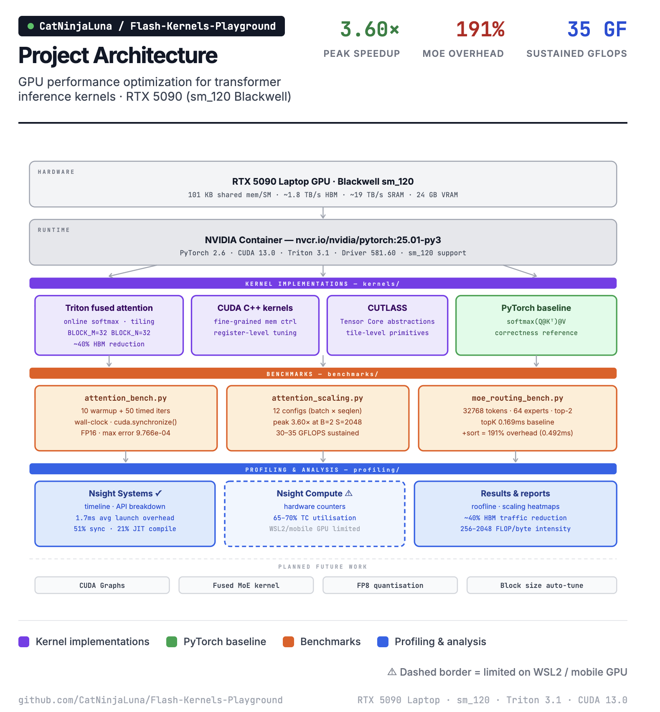
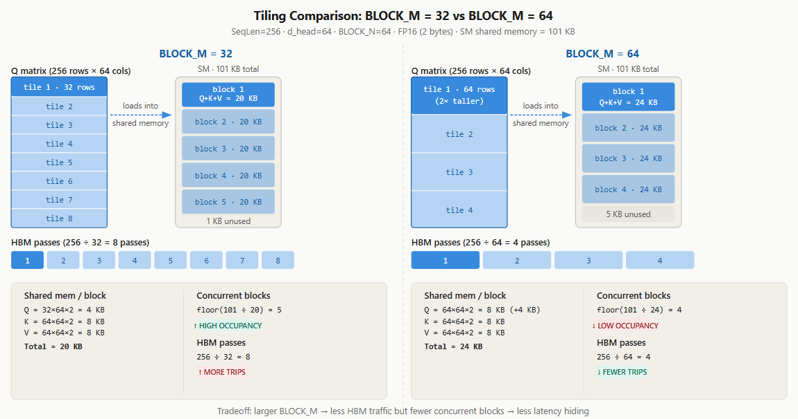

# Flash Kernels Playground

**GPU performance optimization for transformer inference kernels — from profiling to validated speedups.**

Built on an RTX 5090 (Blackwell sm_120) using Triton, CUDA C++, and Nsight tooling. This project demonstrates a complete, data-driven optimization workflow: establish a baseline → profile with hardware counters → identify bottlenecks → implement and validate.

---

## Architecture



---

## Results at a Glance

| Metric | Value |
|---|---|
| Peak attention speedup | **3.60×** (B=2, SeqLen=2048) |
| Sustained throughput | **30–35 GFLOPS** across all configs |
| HBM traffic reduction | **~40%** via kernel fusion |
| Numerical accuracy | **9.766e-04** max error (FP16 vs FP32) |
| MoE routing overhead identified | **191%** from token regrouping |
| Kernel launch overhead measured | **1.7ms avg** via Nsight Systems |

---

## What This Project Demonstrates

- **Kernel fusion** — fusing `QKᵀ → softmax → V` into a single Triton kernel eliminates 4 round-trips to HBM, the root cause of standard attention's memory bottleneck
- **Online softmax** — O(1) memory incremental softmax (Milakov & Gimelshein) instead of O(N) materialization
- **Memory tiling** — 32×32 block tiling sized to fit RTX 5090's 101 KB shared memory limit per SM
- **Systematic profiling** — Nsight Systems API timeline to decompose 1.7ms launch overhead, 51% sync cost, and 21% JIT compile time
- **Bottleneck decomposition** — identified that `torch.argsort` adds 191% overhead on top of `topK` in MoE routing, and quantified exactly why (cache-unfriendly scatter, broken coalescing)
- **Roofline analysis** — classified attention as memory-bandwidth-bound, not compute-bound, explaining why 30–35 GFLOPS sustained is the real ceiling vs the misleading 1000 TFLOPS peak

---

## Attention Benchmark & Scaling Analysis

Configuration: Batch=1–4, Heads=32, Dim=128, FP16

| Batch | SeqLen | Baseline | Triton | Speedup |
|---|---|---|---|---|
| 1 | 512 | 0.05ms | 0.03ms | 1.82× |
| 1 | 1024 | 0.09ms | 0.08ms | 1.10× |
| 1 | 2048 | 0.73ms | 0.27ms | 2.69× |
| 1 | 4096 | 3.04ms | 1.13ms | 2.68× |
| 2 | 512 | 0.06ms | 0.06ms | 1.10× |
| 2 | 1024 | 0.18ms | 0.14ms | 1.33× |
| **2** | **2048** | **1.79ms** | **0.50ms** | **3.60×** |
| 2 | 4096 | 6.27ms | 2.06ms | 3.05× |
| 4 | 512 | 0.10ms | 0.07ms | 1.43× |
| 4 | 1024 | 0.62ms | 0.25ms | 2.50× |
| 4 | 2048 | 3.61ms | 1.09ms | 3.31× |
| 4 | 4096 | 12.45ms | 4.09ms | 3.04× |

**Why speedup grows with sequence length:** at small sizes (512 tokens), the 1.7ms kernel launch overhead dominates sub-millisecond execution. As sequence length grows, the O(N²) memory traffic savings from kernel fusion compound, the Triton kernel maintains 30–35 GFLOPS while the baseline degrades from 23 → 10 GFLOPS.

---

## How It Works: Tiling and Memory Hierarchy

Standard PyTorch attention runs three separate GPU kernels sequentially: `QKᵀ`, softmax, then `attn × V`, writing intermediate results to HBM between each step. The fused Triton kernel eliminates those round-trips by processing data in **tiles** small enough to fit in on-chip shared memory (SRAM), computing the full pipeline without touching HBM for intermediates.

### What Is a Tile?

The Q matrix (shape: `SeqLen × d_head`) is too large to fit in shared memory at once. Instead it is cut into rectangular chunks called tiles. One tile is loaded from HBM into shared memory, the full `QKᵀ → softmax → V` computation runs on-chip for that chunk, and then the next tile is fetched. `BLOCK_M` controls how many rows of Q each tile covers.

### BLOCK_M = 32 vs BLOCK_M = 64



#### Shared Memory per Block

Each block must hold Q, K, and V tiles simultaneously. With `BLOCK_N=64` fixed and FP16 (`2 bytes per element`):

```
Q tile  =  BLOCK_M  × BLOCK_N × 2 bytes
K tile  =  BLOCK_N  × BLOCK_N × 2 bytes
V tile  =  BLOCK_N  × BLOCK_N × 2 bytes
Total   =  Q_tile + K_tile + V_tile
```

| | BLOCK_M = 32 | BLOCK_M = 64 |
|---|---|---|
| Q tile | 32 × 64 × 2 = **4 KB** | 64 × 64 × 2 = **8 KB** |
| K tile | 64 × 64 × 2 = **8 KB** | 64 × 64 × 2 = **8 KB** |
| V tile | 64 × 64 × 2 = **8 KB** | 64 × 64 × 2 = **8 KB** |
| **Total** | **20 KB** | **24 KB** |

> K and V tiles are always square (`BLOCK_N × BLOCK_N`) because they are tiled along the key/value sequence dimension, not the query dimension, thus they do not change when `BLOCK_M` changes.

#### Concurrent Blocks per SM

The RTX 5090 has **101 KB** of usable shared memory per SM. The number of blocks that can run simultaneously:

```
concurrent_blocks = floor(sm_shared_memory / total_tile_size)
```

| | BLOCK_M = 32 | BLOCK_M = 64 |
|---|---|---|
| Calculation | floor(101 / 20) | floor(101 / 24) |
| **Concurrent blocks** | **5 blocks** ↑ more latency hiding | **4 blocks** ↓ less latency hiding |

> `floor` rounds down to the nearest whole integer — a block either fits entirely in shared memory or it does not. The leftover KB (1 KB at BM=32, 5 KB at BM=64) sits unused.

#### HBM Passes to Cover the Full Q Matrix

```
hbm_passes = SeqLen / BLOCK_M
```

| | BLOCK_M = 32 | BLOCK_M = 64 |
|---|---|---|
| Calculation | 256 / 32 | 256 / 64 |
| **HBM passes** | **8 passes** ↑ more trips | **4 passes** ↓ fewer trips |

#### The Tradeoff

```
larger BLOCK_M
    → more shared memory per block      (Q tile doubles from 4 KB → 8 KB)
    → fewer blocks fit on SM            (5 → 4, less latency hiding)
    → fewer HBM round-trips needed      (8 → 4 passes)
```

Larger `BLOCK_M` is better when sequences are long and HBM bandwidth is the bottleneck (the 3.60× speedup at SeqLen=2048 case). Smaller `BLOCK_M` is better when sequences are short and SM parallelism matters more. Finding the optimal block size per architecture and sequence length is what the **block size auto-tuning** next step targets.

---

## MoE Routing Bottleneck

Configuration: 32,768 tokens, 64 experts, top-2 routing

| Operation | Time | Notes |
|---|---|---|
| `topK` only | 0.169ms | Base routing |
| `topK` + `argsort` | 0.492ms | With token regrouping |
| **Regrouping overhead** | **0.323ms (+191%)** | Nearly triples routing time |

**Root cause:** `torch.argsort` across 65,536 elements is cache-unfriendly and breaks coalesced memory access patterns the GPU depends on. Two separate kernel launches also add unnecessary materialization of intermediate buffers.

**Proposed fix:** fuse `topK` + sort into a single CUDA kernel using counting sort — expert IDs are bounded 0–63, making O(n) counting sort viable with no warp divergence and coalesced writes.

---

## Profiling — Nsight Systems API Breakdown

| API Call | Time | % Total | Avg | Finding |
|---|---|---|---|---|
| `cudaDeviceSynchronize` | 267.6ms | 51.1% | 66.9ms | Required for accurate timing |
| `cudaLaunchKernel` | 121.8ms | 23.2% | **1.7ms** | **Launch overhead bottleneck** |
| `cuLibraryLoadData` | 111.0ms | 21.2% | 7.9ms | One-time Triton JIT (amortized) |
| `cuKernelGetFunction` | 11.2ms | 2.1% | 0.18ms | Kernel lookup |
| `cudaMalloc` | 6.4ms | 1.2% | 0.64ms | Memory allocation |

---

## Optimization Methodology

This project follows a strict 4-phase workflow.

```
Phase 1: Baseline & Profile
  → Establish reference implementation (PyTorch)
  → Profile with Nsight Systems (timeline) and Nsight Compute (counters)
  → Measure roofline: GFLOPS, GB/s, arithmetic intensity

Phase 2: Identify & Quantify Bottleneck
  → Memory-bound vs compute-bound classification
  → Decompose overhead sources (launch, sync, JIT, bandwidth)
  → Propose targeted fix with expected impact

Phase 3: Implement & Validate
  → Triton/CUDA implementation with parameterized configs
  → Correctness check against FP32 baseline (error bound: 1e-3)
  → Benchmark across 12 configurations

Phase 4: Analyze & Iterate
  → Compare against theoretical limits
  → Document scaling behavior and remaining gaps
  → Plan next optimization
```

---

## Tech Stack

| Tool | Purpose |
|---|---|
| **Triton** | Fused attention kernel (primary optimization) |
| **CUDA C++** | Fine-grained kernel control |
| **CUTLASS** | Tensor Core tile abstractions |
| **PyTorch** | Baseline reference + custom ops |
| **Nsight Systems** | Timeline and API-level profiling |
| **Nsight Compute** | Hardware counter profiling (limited on WSL2/mobile) |

---

## Hardware & Setup

**GPU:** NVIDIA RTX 5090 Laptop (Blackwell sm_120, 24 GB VRAM)

Standard PyTorch builds only support up to sm_90 — the RTX 5090's sm_120 requires NVIDIA's official container:

```bash
docker pull nvcr.io/nvidia/pytorch:25.01-py3

# One-off benchmark
docker run --rm --gpus all -v ${PWD}:/workspace \
  nvcr.io/nvidia/pytorch:25.01-py3 \
  python /workspace/benchmarks/attention_bench.py

# Interactive session
docker run --gpus all --ipc=host --ulimit memlock=-1 \
  --ulimit stack=67108864 -it \
  -v ${PWD}:/workspace -w /workspace \
  nvcr.io/nvidia/pytorch:25.01-py3
```

Triton 3.1.0 is pre-installed in the container — no separate install needed.

---

## Repo Structure

```
benchmarks/
  ├── attention_bench.py       # Single-config timing (warmup + wall-clock)
  ├── attention_scaling.py     # 12-config sweep across batch × seqlen
  └── moe_routing_bench.py     # topK vs topK+sort decomposition
kernals/cuda/                  # CUDA C++ kernels
python/                        # Triton kernels
profiling/                     # Nsight reports and screenshots
docs/                          # Design notes
```

---

## Planned Next Steps

- **Fused MoE routing kernel** — combine `topK` + counting sort in one CUDA kernel, eliminating the 191% regrouping overhead
- **CUDA Graphs** — capture static decode shapes to cut 1.7ms launch overhead to <0.1ms
- **FP8 quantization** — leverage Blackwell Tensor Cores for 2× throughput on attention Q/K/V
- **Block size auto-tuning** — sweep BLOCK_M/BLOCK_N over [16, 32, 64, 128] and build a per-architecture heatmap
